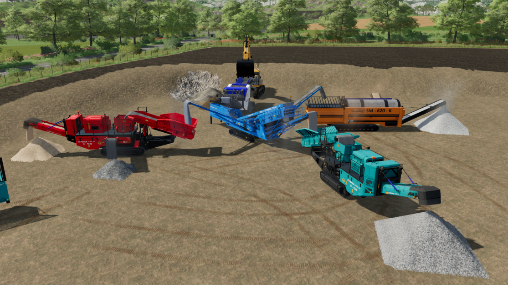
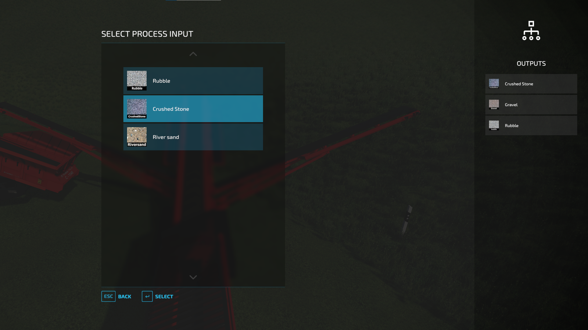

# FS22_DistributorSpecialization

Specialization for vehicles that adds functionality for processing input fillTypes into single/multiple output fillTypes.

Vehicles can also discharge multiple fillTypes simultaneously, both to ground and/or to objects.

Multiple inputs are supported and can be changed by player using in-game GUI. The corresponding output fillTypes are then changed based on definitions in the vehicle XML.

To get started with machines you can find compatible mods created by FS Miner at [official webpage](https://www.fsminer.net/).

## Processors

### Split Processor

The only processor type available for now is the Split Processor.

The amount of input can be split into the outputs by ratio values.

Examples:
| Input | Output | Ratio |
|-------|--------|-------|
| STONES| GRAVEL | 0.8   |
|       | RUBBLE | 0.2   |
|  |  |  |
| GRAVEL| DIRT   | 0.35  |
|       | SAND   | 0.65  |

Input configurations can also have various number of outputs:

Examples:
| Input | Output | Ratio |
|-------|--------|-------|
| STONES| GRAVEL   | 0.7 |
|       | PEBBLES  | 0.2 |
|       | STONEDUST| 0.1 |
|  |  |  |
| GRAVEL| DIRT   | 0.35  |
|       | SAND   | 0.65  |

Limitations:
- Maximum of 16 input configurations
- Maximum of 16 outputs per input

NOTE:
This specialization mod does NOT provide any fillTypes.

## Documentation
For implementation documentation: [SPECIALIZATION.md](./docs/SPECIALIZATION.md)

## Multiplayer

Mod has been tested on dedicated server and is supported. Issues may occur and if so please create a Issue here on github with details.

## Known issues

* Discharge to ground animations still playing while processing is idle
